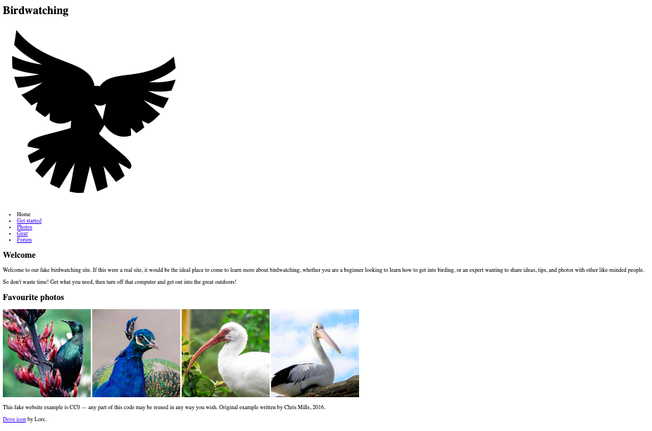
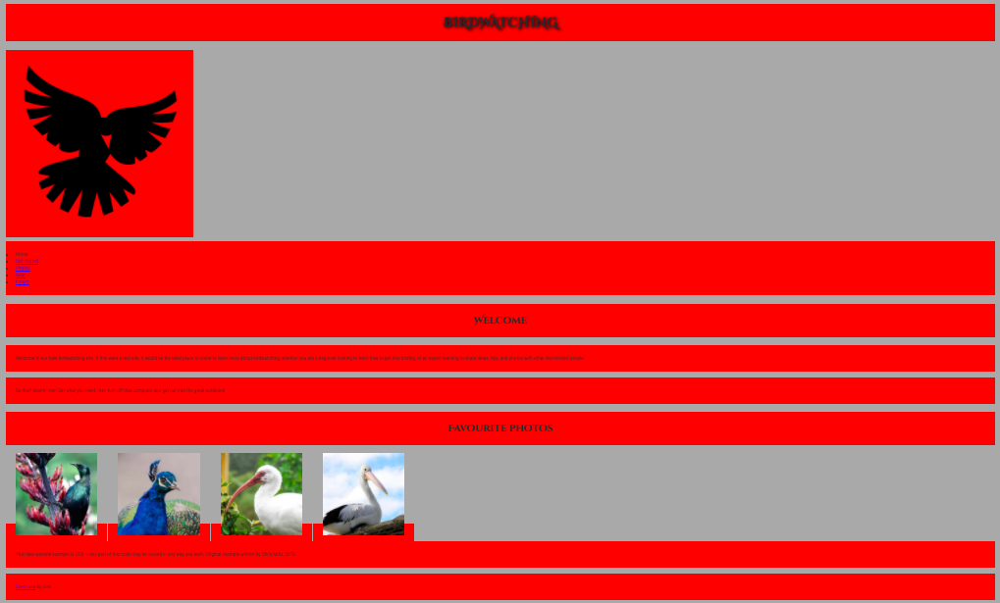

# Cambios realizados para completar el examen

Para la realización de la segunda parte del examen se han tomado los archivos base proporcionados (imágenes, CSS e índice).

Este era el aspecto original del documento HTML proporcionado.

A continuación se añade el CSS proporcionado a través de la etiqueta *link*

